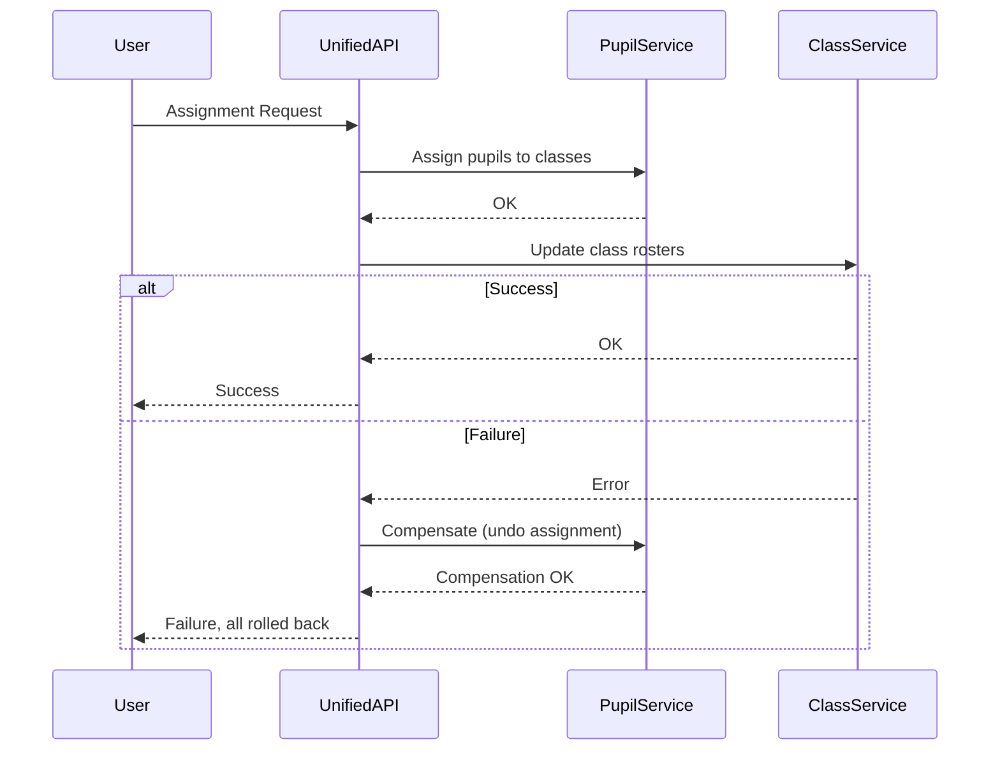

# Data Consistency in Distributed Systems: The Saga Pattern

In a distributed system like SchoolManager, where multiple microservices (e.g., Pupil Service and Class Service) must be updated together, ensuring data consistency is critical. If a failure occurs during a multi-step update, the system must avoid ending up in a partially updated (inconsistent) state.

## The Saga Pattern

The Saga pattern is a way to manage distributed transactions without requiring a distributed transaction coordinator. Instead, a saga is a sequence of local transactions. If any step fails, compensating transactions are executed to undo the changes made by previous steps.

### How It Works
1. The process is split into a series of steps (local transactions), each handled by a different service.
2. If all steps succeed, the transaction is complete.
3. If any step fails, compensating actions are triggered to roll back the previous steps, restoring consistency.

## Example: Assigning Pupils to Classes

Suppose the Unified API needs to assign pupils to classes, which involves updating both the Pupil Service and the Class Service.

### Steps
1. **Start Saga:** Unified API receives the assignment request.
2. **Step 1:** Update Pupil Service (assign pupils to classes).
3. **Step 2:** Update Class Service (update class rosters/counts).
4. **If Step 2 fails:** Trigger a compensating transaction to undo the changes in the Pupil Service.

### Mermaid Flow Diagram

## Benefits
- **No distributed locks:** Each service manages its own data.
- **Resilience:** If a step fails, previous steps can be undone.
- **Fits microservices:** Each service only needs to know how to perform and compensate its own actions.

## Considerations
- Compensating actions must be carefully designed to truly undo previous steps.
- Sagas provide eventual consistency, not always immediate consistency.
- Monitoring and logging are important to detect and handle failures.

---

_This approach is recommended for SchoolManager to ensure robust, consistent updates across multiple microservices._ 